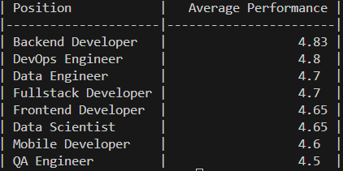

Вот пример README для твоего проекта с инструкциями по созданию виртуального окружения и установке зависимостей:
# CSV Report Generator

Скрипт для генерации отчёта о производительности сотрудников на основе CSV-файлов.

---

## Требования

- Python 3.10+ (рекомендовано 3.13)
- Windows / Linux / MacOS

---

## Установка

```bash
git clone https://github.com/MaksimDyumin/scv_report.git
cd scv_report
python -m venv .venv
```
Активируйте виртуальное окружение
```bash

Windows (PowerShell / Git Bash)
.venv\Scripts\activate

Linux / MacOS
source .venv/bin/activate
```


Установите зависимости
```bash
pip install tabulate pytest pytest-cov
```

Использование
```bash
Пример запуска скрипта:
python g_reports.py --files employees1.csv employees2.csv --report performance
```


- --files — список CSV-файлов с данными.


- --report — имя отчёта. В данный момент поддерживается только performance.


## Тестирование и покрытие кода
Для запуска тестов с измерением покрытия:
```bash
pytest --cov=g_reports --cov-report term-missing
```

- --cov=g_reports — измеряем покрытие модуля g_reports.py.

- --cov-report term-missing — выводит строки, которые не были выполнены.


```bash
Структура проекта
scv_report/
├─ g_reports.py        # основной скрипт
├─ test_g_reports.py   # тесты
├─ README.md           # эта инструкция
└─ .venv/              # виртуальное окружение
```

## Пример отчета
Данные взяты из примера указанного в тексте тестового
```bash
python g_reports.py --files employees1.csv employees2.csv --report performance
```

